# Near Stake Wars: Episode III Guide Challenge 1-4
* Publication date: 2022-07-25 (**guide is up to date**)
* Total rewards: 55 Unlocked NEAR Points (UNP)
* Deadline: 11.08.2022


## Useful links
Wallet: https://wallet.shardnet.near.org/

Explorer: https://explorer.shardnet.near.org/ 

My Telegram: https://t.me/vindemure


## 1. Buying and setting up a server

First, you must select a server from any provider suitable for the category:

* **CPU** - 4-Core CPU with AVX support 
* **RAM** - 8GB DDR4   
* **Storage** 500GB SSD

I recommend contabo and hetzner from my experience


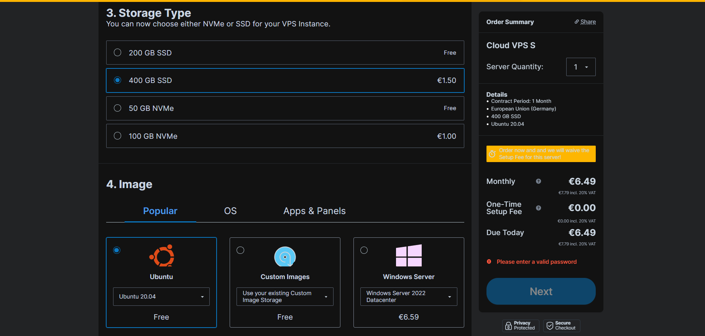

Then login to the server, I recommend Mobaxterm

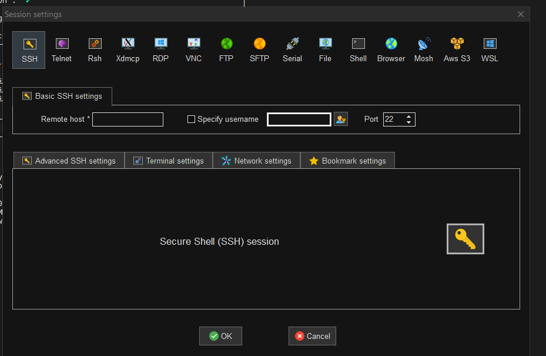

Great, Jedi!

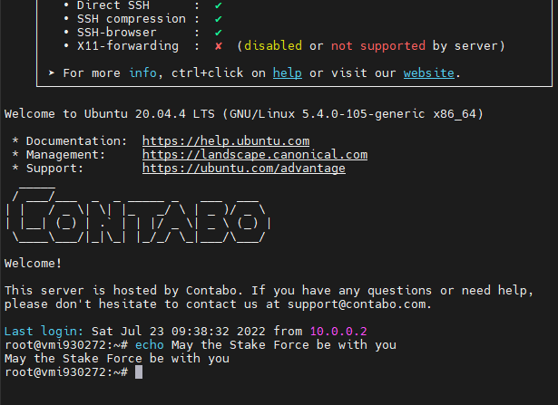


## 2. First steps in server

Let's make sure the linux machine is up-to-date.
```
sudo apt update && sudo apt upgrade -y
```

Install developer tools.

`Node.js` and `npm`:
```
curl -sL https://deb.nodesource.com/setup_18.x | sudo -E bash -  
sudo apt install build-essential nodejs
PATH="$PATH"
```

Check `Node.js` and `npm` version:
```
node -v
```
> v18.x.x

```
npm -v
```
> 8.x.x

Before you start, you may want to confirm that your machine has the right CPU features.
```
lscpu | grep -P '(?=.*avx )(?=.*sse4.2 )(?=.*cx16 )(?=.*popcnt )' > /dev/null \
  && echo "Supported" \
  || echo "Not supported"
```
> Supported

Install developer tools:
```
sudo apt install -y git binutils-dev libcurl4-openssl-dev zlib1g-dev libdw-dev libiberty-dev cmake gcc g++ python docker.io protobuf-compiler libssl-dev pkg-config clang llvm cargo
```
Install Python pip:

```
sudo apt install python3-pip
```
Set the configuration:

```
USER_BASE_BIN=$(python3 -m site --user-base)/bin
export PATH="$USER_BASE_BIN:$PATH"
```

Install Building env
```
sudo apt install clang build-essential make
```

Install Rust & Cargo
```
curl --proto '=https' --tlsv1.2 -sSf https://sh.rustup.rs | sh
```
> Press 1 press enter.
>
> 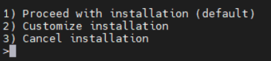

Source the environment
```
source $HOME/.cargo/env
```


## 3. Let's NEAR

### Create a wallet 
https://wallet.shardnet.near.org/

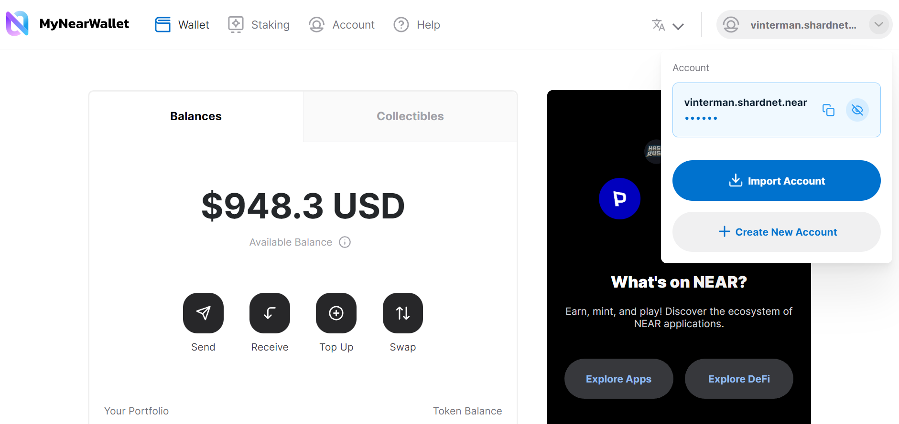

Write down your mnemonic phrase and the name of the wallet, the name of the wallet (future pool owner_id, accountId) will be needed very often in the future

>My accountId: **vinterman.shardnet.near**

### Install NEAR-CLI

NEAR-CLI is a command-line interface that communicates with the NEAR blockchain via remote procedure calls (RPC). For security reasons, it is recommended that NEAR-CLI be installed on a different computer than your validator node and that no full access keys be kept on your validator node.

Github Repository for NEAR CLI.: https://github.com/near/near-cli. 

To install NEAR-CLI, unless you are logged in as root, which is not recommended you will need to use `sudo` to install NEAR-CLI so that the near binary is saved to /usr/local/bin

```
sudo npm install -g near-cli
```

### Environment
The environment will need to be set each time a new shell is launched to select the correct network.

**Shardnet** is the network we will use for Stake Wars.

Command:
```
export NEAR_ENV=shardnet
```

Set the Near testnet Environment persistent:
```
echo 'export NEAR_ENV=shardnet' >> ~/.bashrc
```


### NEAR CLI Commands:

```
near proposals
```
> A proposal by a validator indicates they would like to enter the validator set, in order for a proposal to be accepted it must meet the minimum seat price.

```
near validators current
```
> A list of active validators in the current epoch, the number of blocks produced, number of blocks expected, and online rate. Used to monitor if a validator is having issues.

```
near validators next
```
> Validators whose proposal was accepted one epoch ago, and that will enter the validator set in the next epoch.

## 4. Setup your node
Clone the [`nearcore` repository](https://github.com/near/nearcore).

```
git clone https://github.com/near/nearcore
cd nearcore
git fetch
```
Checkout to the [commit](https://github.com/near/stakewars-iii/blob/main/commit.md) needed. 

```
git checkout <commit>
```
When writing a guide, I enter and carefully read the output:
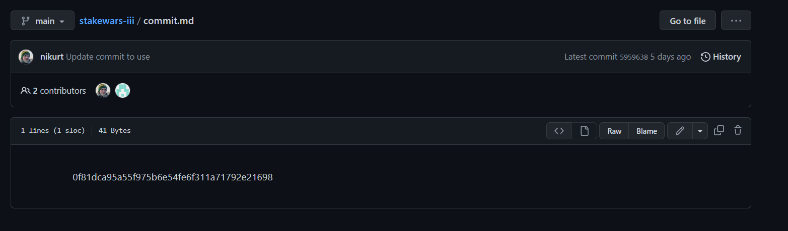
```
git checkout 0f81dca95a55f975b6e54fe6f311a71792e21698
```


Compile `nearcore` binary in the `nearcore` folder run the following commands:
```
cargo build -p neard --release --features shardnet
```


Initialize working directory
In order to work properly, the NEAR node requires a working directory and a couple of configuration files. Generate the initial required working directory by running:
```
./target/release/neard --home ~/.near init --chain-id shardnet --download-genesis
```
This command will create the directory structure and will generate `config.json`, `node_key.json`, and `genesis.json` on the network you have passed. 

* **config.json** - Configuration parameters which are responsive for how the node will work. The config.json contains needed information for a node to run on the network, how to communicate with peers, and how to reach consensus. Although some options are configurable. In general validators have opted to use the default config.json provided.

* **genesis.json** - A file with all the data the network started with at genesis. This contains initial accounts, contracts, access keys, and other records which represents the initial state of the blockchain. The genesis.json file is a snapshot of the network state at a point in time. In contacts accounts, balances, active validators, and other information about the network. 

* **node_key.json** -  A file which contains a public and private key for the node. Also includes an optional `account_id` parameter which is required to run a validator node (not covered in this doc).

* **data/** -  A folder in which a NEAR node will write it's state.

Replace the **config.json**

From the generated **config.json**, there two parameters to modify:
* **boot_nodes**: If you had not specify the boot nodes to use during init in Step 3, the generated `config.json` shows an empty array, so we will need to replace it with a full one specifying the boot nodes.
* **tracked_shards**: In the generated **config.json**, this field is an empty. You will have to replace it to `"tracked_shards": [0]`

```
rm ~/.near/config.json
wget -O ~/.near/config.json https://s3-us-west-1.amazonaws.com/build.nearprotocol.com/nearcore-deploy/shardnet/config.json
```

Get latest snapshot:

Install AWS Cli
```
sudo apt-get install awscli -y
```
```
pip3 install awscli --upgrade
```
Download snapshot (genesis.json)
```
// IMPORTANT: NOT REQUIRED TO GET SNAPSHOT AFTER HARDFORK ON SHARDNET DURING 2022-07-18
cd ~/.near
wget https://s3-us-west-1.amazonaws.com/build.nearprotocol.com/nearcore-deploy/shardnet/genesis.json
```
**IMPORTANT: NOT REQUIRED TO GET SNAPSHOT AFTER HARDFORK ON SHARDNET DURING 2022-07-18**

## 5. Run the node

```
cd ~/nearcore
./target/release/neard --home ~/.near run
```
>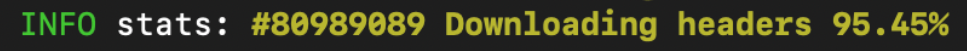

>We are waiting for synchronization to 100%
>
>`Ctrl + C`

## 6. Authorize Wallet
**The hardest part that needs the most attention**

Authorization of a full access key to be copied locally:
```
near login
```
Copy the link in your browser:


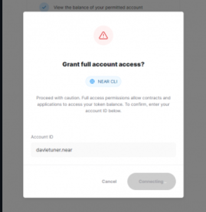

After **grant full account access**, you will see a page like this:
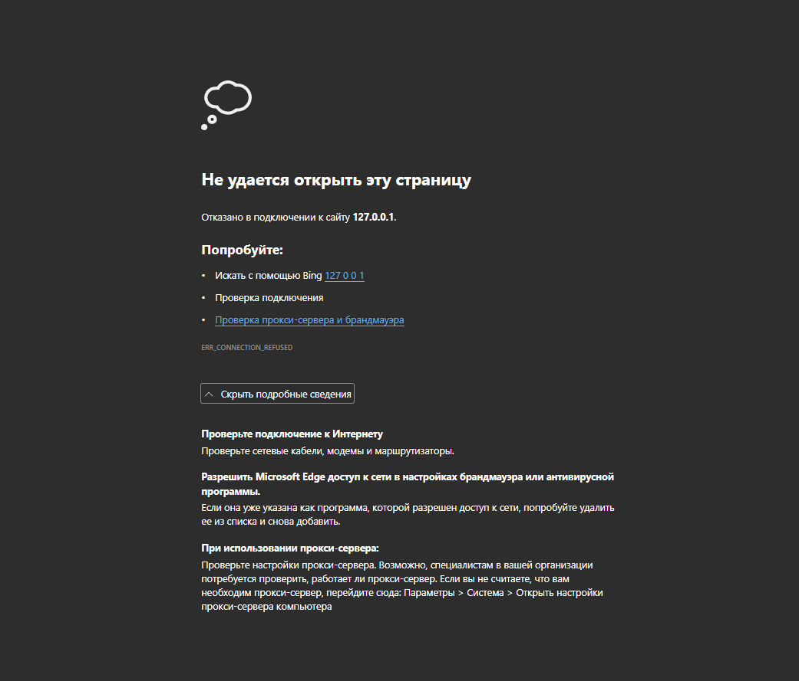

Go back and enter your wallet (walletname.shardnet.near):

I enter vinter_man.shardnet.near

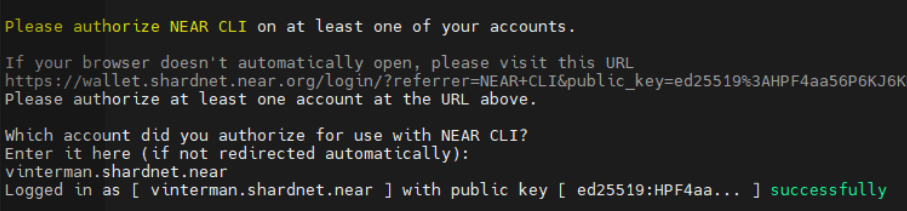

Create a `validator_key.json`:

<pool_id> = < poolname >.factory.shardnet.near

I chose pool name **vinter_man** ---> my pool id is **vinterman.factory.shardnet.near**
```
near generate-key <pool_id>
```
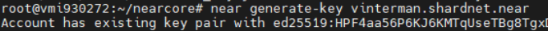

Copy the file generated to shardnet folder:

```
cp ~/.near-credentials/shardnet/<input_your>.json ~/.near/validator_key.json
```
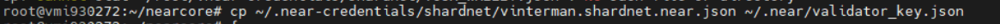
```
nano /.near/validator_key.json
```
```
{
  "account_id": "....factory.shardnet.near",
  "public_key": "ed25...",
  "secret_key": "ed25..."
}
```
```Ctrl + X ``` -> ```y``` -> ```Enter```
```
nano /.near-credentials/shardnet/<input_your>.json
```
```
{
  "account_id": "....factory.shardnet.near",
  "public_key": "ed25...",
  "secret_key": "ed25..."
}
```
```Ctrl + X ``` -> ```y``` -> ```Enter```

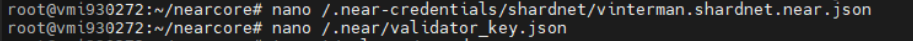

## 7. Activating the node as validator

Start the validator node:
```
target/release/neard run
```
Setup Systemd:
```
sudo nano /etc/systemd/system/neard.service
```
Paste and change <User>, WorkingDirectory, ExecStart for yours
```
[Unit]
Description=NEARd Daemon Service

[Service]
Type=simple
User=<USER>
#Group=near
WorkingDirectory=/home/<USER>/.near
ExecStart=/home/<USER>/nearcore/target/release/neard run
Restart=on-failure
RestartSec=30
KillSignal=SIGINT
TimeoutStopSec=45
KillMode=mixed

[Install]
WantedBy=multi-user.target
```
```Ctrl + X ``` -> ```y``` -> ```Enter```

My:
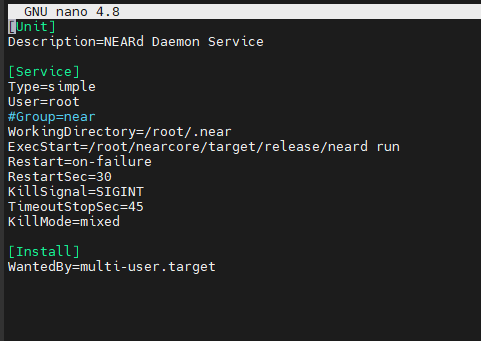

```
sudo systemctl enable neard
```
```
sudo systemctl start neard
```
If you need to make a change to service because of an error in the file. It has to be reloaded:
```
sudo systemctl reload neard
```
Watch logs:
```
journalctl -n 100 -f -u neard
```

#### To be a validator:
* The node must be fully synced (100%)
* The `validator_key.json` must be in place 
* The contract must be initialized with the public_key in `validator_key.json`
* The account_id must be set to the staking pool contract id
* There must be enough delegations to meet the minimum seat price (400 NEAR for now). See the seat price [here](https://explorer.shardnet.near.org/nodes/validators).
* A proposal must be submitted by pinging the contract
* Once a proposal is accepted a validator must wait 2-3 epoch to enter the validator set
* Once in the validator set the validator must produce great than 90% of assigned blocks

Check running status of validator node. If “Validator” is showing up, your pool is selected in the current validators list.

Calls the staking pool factory, creates a new staking pool with the specified name, and deploys it to the indicated accountId.

```
near call factory.shardnet.near create_staking_pool '{"staking_pool_id": "<pool id>", "owner_id": "<accountId>", "stake_public_key": "<public key>", "reward_fee_fraction": {"numerator": 5, "denominator": 100}, "code_hash":"DD428g9eqLL8fWUxv8QSpVFzyHi1Qd16P8ephYCTmMSZ"}' --accountId="<accountId>" --amount=30 --gas=300000000000000
```

From the example above, you need to replace:

* **Pool ID**: Staking pool name, the factory automatically adds its name to this parameter, creating {pool_id}.{staking_pool_factory}
Examples:   

- If pool id is `vinterman` will automatically create : `vinterman.factory.shardnet.near`

* **Owner ID**: The SHARDNET account (i.e. vinterman.shardnet.near) that will manage the staking pool.
* **Public Key**: The public key in your **validator_key.json** file. `nano /.near/validator_key.json`
* **5**: The fee the pool will charge (e.g. in this case 5 over 100 is 5% of fees).
* **Account Id**: The SHARDNET account deploying and signing the mount tx.  Usually the same as the Owner ID.

**Be sure to have at least 30 NEAR available**

Example:
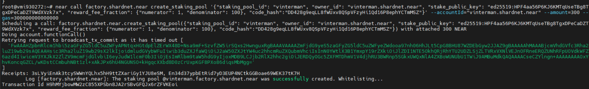

To change the pool parameters, such as changing the amount of commission charged to 1% in the example below, use this command:
```
near call <pool_name> update_reward_fee_fraction '{"reward_fee_fraction": {"numerator": 1, "denominator": 100}}' --accountId <account_id> --gas=300000000000000
```
**You have now configure your Staking pool.**

Check your pool is now visible on https://explorer.shardnet.near.org/nodes/validators

## 8. Transactions

Deposit and Stake NEAR
```
near call <staking_pool_id> deposit_and_stake --amount <amount> --accountId <accountId> --gas=300000000000000
```
Unstake NEAR (Amount in yoctoNEAR):
```
near call <staking_pool_id> unstake '{"amount": "<amount yoctoNEAR>"}' --accountId <accountId> --gas=300000000000000
```
To unstake all:
```
near call <staking_pool_id> unstake_all --accountId <accountId> --gas=300000000000000
```
Withdraw (unstaking takes 2-3 epochs to complete, after that period you can withdraw in YoctoNEAR from pool)
```
near call <staking_pool_id> withdraw '{"amount": "<amount yoctoNEAR>"}' --accountId <accountId> --gas=300000000000000
```
To withdraw all:
```
near call <staking_pool_id> withdraw_all --accountId <accountId> --gas=300000000000000
```

A ping issues a new proposal and updates the staking balances for your delegators. A ping should be issued each epoch to keep reported rewards current.
```
near call <staking_pool_id> ping '{}' --accountId <accountId> --gas=300000000000000
```
Total Balance:
```
near view <staking_pool_id> get_account_total_balance '{"account_id": "<accountId>"}'
```
Staked Balance:
```
near view <staking_pool_id> get_account_staked_balance '{"account_id": "<accountId>"}'
```
Unstaked Balance:
```
near view <staking_pool_id> get_account_unstaked_balance '{"account_id": "<accountId>"}'
```
Available for Withdrawal:
(You can only withdraw funds from a contract if they are unlocked)
```
near view <staking_pool_id> is_account_unstaked_balance_available '{"account_id": "<accountId>"}'
```
Pause staking
```
near call <staking_pool_id> pause_staking '{}' --accountId <accountId>
```
Resume staking
```
near call <staking_pool_id> resume_staking '{}' --accountId <accountId>
```

## 8. Setup tools for monitoring node status
RPC
```
sudo apt install curl jq
```
Check your node version:
```
curl -s http://127.0.0.1:3030/status | jq .version
```
Check Delegators and Stake
```
near view <your pool>.factory.shardnet.near get_accounts '{"from_index": 0, "limit": 10}' --accountId <accountId>.shardnet.near
```
Check Reason Validator Kicked
```
curl -s -d '{"jsonrpc": "2.0", "method": "validators", "id": "dontcare", "params": [null]}' -H 'Content-Type: application/json' 127.0.0.1:3030 | jq -c '.result.prev_epoch_kickout[] | select(.account_id | contains ("<POOL_ID>"))' | jq .reason
```
Check Blocks Produced / Expected
```
curl -s -d '{"jsonrpc": "2.0", "method": "validators", "id": "dontcare", "params": [null]}' -H 'Content-Type: application/json' 127.0.0.1:3030 | jq -c '.result.current_validators[] | select(.account_id | contains ("POOL_ID"))'
```
Delete node
```
sudo systemctl stop neard
rm -r nearcore
rm -r .near
```
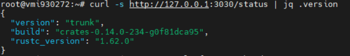
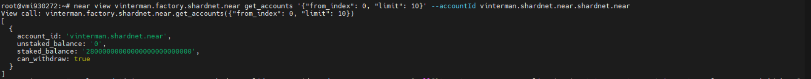

## 9. What's next?
Move on to the next steps, I recommend trying to complete all the challenges:
https://github.com/near/stakewars-iii/tree/main/challenges


Thank you for your attention, put stars if the guide was useful to you :)

If you have questions and problems - first of all, use the search in the [discord](https://discord.gg/jh8YrH6h) chat - then you can write to me in [my telegram](https://discord.gg/jh8YrH6h).

Good luck and may the force be with you!

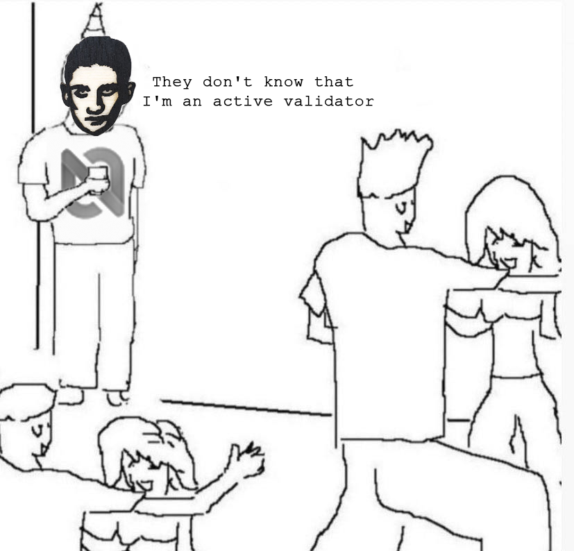
